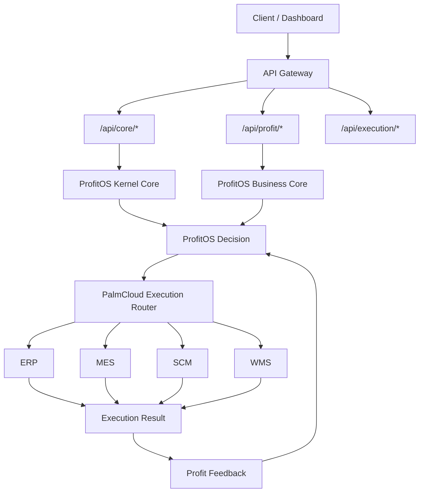

# ProfitOS Production Architecture v1.0

## 1. Architecture Freeze

ProfitOS production architecture is frozen as a two-layer operating model:

- ProfitOS = Decision Layer
- PalmCloud = Execution Layer

The previous V7-V11 meta expansion model is no longer a product architecture. Any remaining implementation files are internal compatibility modules only and must not be used to define new platform layers.

## 2. Final Product Structure

```text
ProfitOS Production Architecture v1.0
|
|-- ProfitOS Decision Layer
|   |-- Kernel Core
|   |-- Agent Core
|   |-- Business Core
|   |-- Profit Decision APIs
|
|-- PalmCloud Execution Layer
|   |-- ERP
|   |-- MES
|   |-- SCM
|   |-- WMS
|
|-- API Gateway
|   |-- /api/core/*
|   |-- /api/profit/*
|   |-- /api/execution/*
```

## 3. Module Mapping Table

| Module | Product Owner | Layer | Responsibility | API Namespace |
| --- | --- | --- | --- | --- |
| ProfitOS | ProfitOS | Decision Layer | Profit decision, analysis, orchestration | `/api/profit/*` |
| Kernel Core | ProfitOS | Decision Layer | Decision runtime and architecture guardrails | `/api/core/*` |
| Agent Core | ProfitOS | Decision Layer | Planning, decision preparation, agent coordination | `/api/core/*` |
| Business Core | ProfitOS | Decision Layer | Profit calculation and profit matrix | `/api/profit/*` |
| ERP | PalmCloud | Execution Layer | Enterprise resource execution | `/api/execution/erp/*` |
| MES | PalmCloud | Execution Layer | Manufacturing execution | `/api/execution/mes/*` |
| SCM | PalmCloud | Execution Layer | Supply-chain execution | `/api/execution/scm/*` |
| WMS | PalmCloud | Execution Layer | Warehouse execution | `/api/execution/wms/*` |

## 4. API Standard

All public APIs must use one of the following namespaces:

| Namespace | Purpose |
| --- | --- |
| `/api/core/*` | Kernel, module registry, health, and system control APIs |
| `/api/profit/*` | ProfitOS decision and profit computation APIs |
| `/api/execution/*` | PalmCloud execution modules: ERP, MES, SCM, WMS |

Legacy versioned URLs are not allowed as production API contracts.

## 5. Data Flow Diagram



## 6. Structure Lock

No new core layers are allowed after this freeze.

All future work must be classified as:

- Feature implementation
- Execution module implementation
- API endpoint implementation
- UI/product improvement
- Deployment/observability improvement

## 7. Final Declaration

```text
ProfitOS Production Architecture v1.0 is frozen.
ProfitOS is the decision layer.
PalmCloud is the execution layer.
ERP / MES / SCM / WMS are execution modules.
The system is now in production engineering phase.
```
